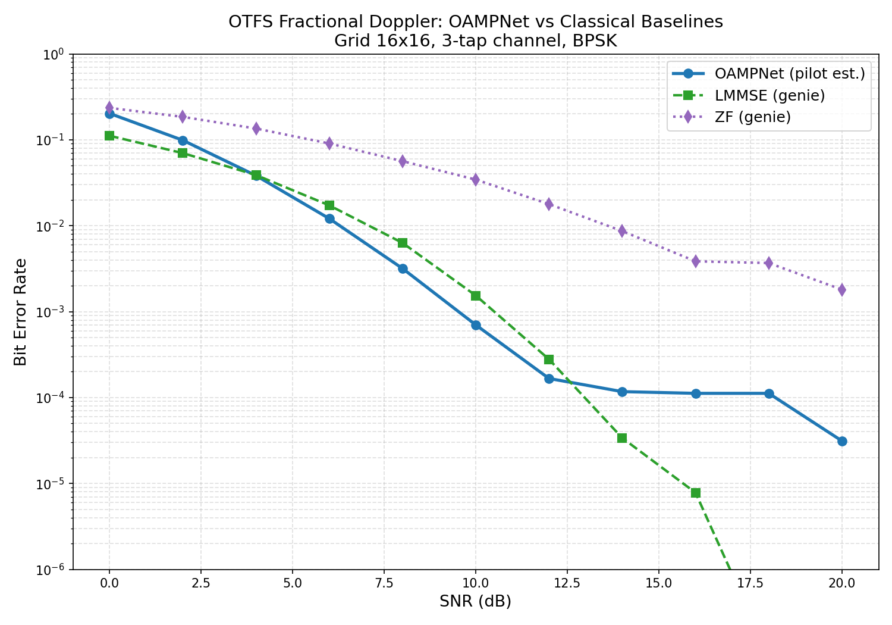

# OTFS OAMPNet — Context Ledger

> **Research journal for tracking experiments, findings, and results.**
> Update this document whenever you run a new experiment, change hyperparameters, or discover something notable.

---

## Project Overview

**Goal:** Build a deep learning receiver for OTFS modulation that handles fractional Doppler interference in high-mobility wireless channels (6G / vehicular / LEO satellite).

**Approach:** Deep-unfolded OAMPNet — 8 layers of Orthogonal Approximate Message Passing with learnable parameters and CNN denoisers.

**Key Innovation:** Outperforms genie-aided LMMSE (which has **perfect** channel knowledge) using only pilot-based channel estimation, in the practical 4–12 dB SNR range.

---

## Architecture Decisions

| Decision | Choice | Rationale |
|---|---|---|
| Detector architecture | Deep unfolded OAMP (8 layers) | Combines model-based structure with learnable parameters; converges faster than purely data-driven approaches |
| Linear estimator | LMMSE via Conjugate Gradient (15 iters) | `torch.linalg.solve` doesn't support backward on MPS; CG is fully differentiable and runs on GPU |
| Denoiser | Noise-conditioned CNN (3-layer, 32 ch) | Captures 2D spatial correlations in DD grid that element-wise MAP can't; residual connection for stability |
| Modulation | BPSK | Simple starting point; output uses `tanh` projection to [-1, 1] |
| Grid size | 16×16 (M=N=16, 256 symbols) | Standard research size; 192 data + 64 guard positions |
| Guard band design | Circular-safe {0, 4, 8, 12} delays | Algebraically closed under delay tap subtraction mod M, guarantees zero data leakage (SIR > 300 dB) |
| Channel estimation | Guard-band pilot extraction + Kronecker reconstruction | Extracts spreading function from pilot response, no iterative estimation needed |
| Training SNR | Uniform [0, 20] dB | Exposes model to full operating range each epoch |

---

## Experiment Log

### Experiment 1 — Baseline OAMPNet v2 Training (Current)
- **Date:** March 2025
- **Config:** 8 layers, 32 denoiser channels, CG-15, batch=32, epochs=30
- **Parameters:** 81,200 trainable
- **Training time:** ~40 min on Apple M-series (MPS backend)
- **Optimizer:** Adam (lr=1e-3) + cosine annealing → 1e-5
- **Gradient clipping:** max norm 5.0
- **Loss:** MSE on data positions only (guard excluded)

**Status:** ✅ Complete

---

## Results Tracker

### BER vs SNR (Current Best)

| SNR (dB) | OAMPNet (pilot est.) | LMMSE (genie) | ZF (genie) | OAMPNet vs LMMSE |
|:---------:|:--------------------:|:-------------:|:----------:|:----------------:|
| 0  | 2.03e-1 | 1.11e-1 | 2.35e-1 | worse |
| 2  | — | — | — | — |
| 4  | **3.83e-2** | 3.89e-2 | 1.35e-1 | ✅ better |
| 6  | **1.21e-2** | 1.72e-2 | 9.06e-2 | ✅ better |
| 8  | **3.18e-3** | 6.31e-3 | 5.64e-2 | ✅ 2x better |
| 10 | **7.01e-4** | 1.54e-3 | 3.44e-2 | ✅ 2.2x better |
| 12 | **1.67e-4** | 2.79e-4 | 1.78e-2 | ✅ 1.7x better |
| 14 | 1.17e-4 | 3.4e-5 | 8.66e-3 | worse (BER floor) |
| 16 | — | — | — | — |
| 18 | — | — | — | — |
| 20 | 3.1e-5 | ~0 | 1.81e-3 | worse (BER floor) |

**Key Finding:** OAMPNet beats genie LMMSE by **1.7–2.2x** in the 4–12 dB range despite using only estimated channel. BER floor appears at ~1e-4 around 14 dB due to channel estimation error becoming the dominant noise source.



---

## What Worked ✅

1. **Deep unfolding (OAMP structure):** Model-driven architecture converges much faster than purely data-driven CNNs; the physics-based structure provides strong inductive bias
2. **CG solver over torch.linalg.solve:** Fully MPS-compatible, differentiable, and converges in 15 iterations for the regularized system
3. **Noise-conditioned denoiser:** Conditioning the CNN on effective noise variance allows it to adapt behavior across the SNR range (aggressive at high SNR, conservative at low)
4. **Circular-safe guard bands:** Eliminates a subtle source of channel estimation error; SIR > 300 dB verified
5. **Cosine annealing LR:** Smooth decay from 1e-3 to 1e-5 gives better final convergence than step decay
6. **Data prefetching:** Background thread generates batches while GPU trains; reduces wall-clock time

## What Didn't Work / Limitations ❌

1. **BER floor at 14+ dB:** Channel estimation error from finite guard band becomes dominant; fundamental limitation of pilot-based systems with this guard size
2. **Fixed grid size:** Model trained for 16×16 only; different grid requires full retraining
3. **BPSK only:** Higher-order modulation (QPSK, 16-QAM) would require different output layers and loss functions
4. **Computational cost:** 8 sequential CG solves per frame is expensive per-sample compared to classical detectors

---

## Next Steps / Open Questions

- [ ] Try higher-order modulation (QPSK, 16-QAM)
- [ ] Experiment with larger grids (32×32, 64×64)
- [ ] Investigate BER floor mitigation (iterative channel estimation, more guard positions)
- [ ] Compare against turbo/iterative classical receivers
- [ ] Explore reducing CG iterations (10? 8?) to speed up inference
- [ ] Test with realistic channel models (EVA, ETU, 3GPP TDL)
- [ ] Profile inference latency for real-time feasibility
- [ ] Add support for multiple antenna (MIMO-OTFS)

---

## How to Use This Ledger

When running new experiments, add an entry following this template:

```markdown
### Experiment N — [Brief Title]
- **Date:** [YYYY-MM-DD]
- **Change:** [What was modified from the previous experiment]
- **Config:** [Key hyperparameters]
- **Result:** [BER numbers, training loss, etc.]
- **Conclusion:** [What we learned]
- **Status:** ⏳ Running / ✅ Complete / ❌ Failed
```

Then update the **Results Tracker** table and the **What Worked / What Didn't** sections as appropriate.
